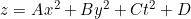

# Zone plate generation

- [Deployed as a Next.js (w/Rust/WASM) site](https://zone.v.imetrical.com/)
- Next.js - WASM - Rust: `./nextjs-wasm-rust/`
- Go version, static cli, and WASM, working, not yet integrated into next app.
- Static image/video generation in Go: `./static-go/`
- Original `C++` code from CRC in `./legacy-CRC/` *circa 1996*
- Original `Fortran` version: *lost*, but if I had it, I would dockerize it!

| VT Zone Plate | VH Zone Plate |
|:-:|:-:|
| ||

## TODO

- [webpack go loader](https://www.aaron-powell.com/posts/2019-02-12-golang-wasm-6-typescript-react/)
- lerna - split go and rust into packages and publish
- api route for images/ per engine
- Buffered frames - RAF is unreliable?
- Exploit symmetry in zone plates
- Content
  - History add scans and pictures
  - Add performance comparative benchmarks (lik in WASM Go README)
    - pub-sub in nats?

## History

I first wrote this code as part af my first undergrad internship at CRC.
My task was to implement these test patterns as part of a video signal processing research group. The original implementation was written in Fortran on a DEC LSI-11 (64kB of memory).

This was my first introduction to conics. The patterns generalize to conic sections or projections:

When I joined the group,..

Thanks to André, Bernard, Gilles, Phil, Tom, Mike, Jean-Pierre, Metin.
