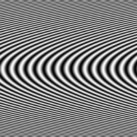
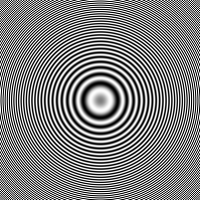
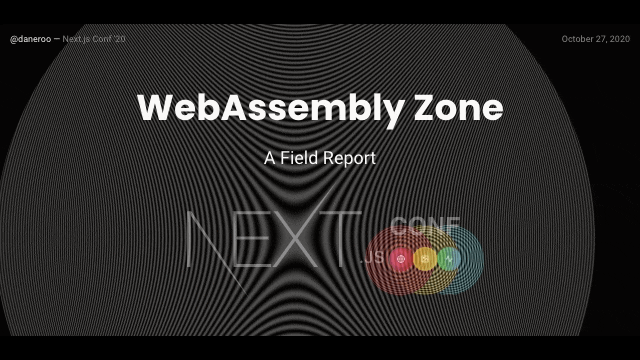
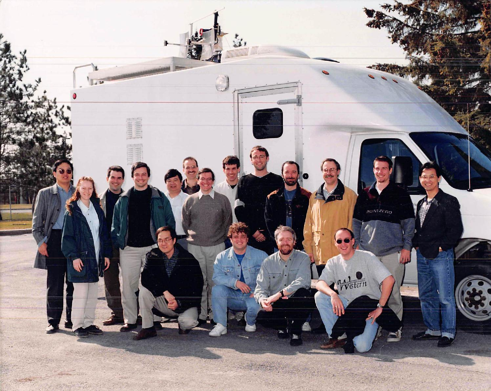

# Zone plate generation

- [Deployed as a Vercel Next.js (w/Rust/WASM) site](https://zone.v.daneroo.com/)
- [Deployed as a Vercel Next.js slide deck](https://zone-deck.v.daneroo.com/)
- Next.js - WASM - Rust - Go: `./packages/*`
- Static image/video generation in Go: `./static-go/`
- Original `C++` code from CRC in `./legacy-CRC/` _circa 1996_
- Original `Fortran` version: _lost_, but if I had it, I would dockerize it!

|                               VT Zone Plate                                |                               VH Zone Plate                                |
| :------------------------------------------------------------------------: | :------------------------------------------------------------------------: |
|  |  |

Given as a [talk at OttawaJS October '20 and first Next.js Conference](https://www.youtube.com/watch?v=jv4Soz08gBw)



## TODO

- Externalize module for zoneplate View/engines/hook/annotate (no controls)
  - [TSdx](https://tsdx.io/)
  - <https://github.com/ovieokeh/npm-react-typescript-template>
  - <https://buttercms.com/blog/nextjs-storybook-and-lerna-build-a-monorepo-structure>
- npm packages
  - normalize the README
  - normalize the package.json scripts - dev build lint test
  - enable jest in libs (microbundle)
- Alternate backend
  - Netlify <https://github.com/netlify/next-on-netlify>
  - Google Cloud Run (Docker)
- Refactor annotations (specific props)
- Minimal testing (unit & integration)
- Go: try to find a zero allocation model (especially for tinyGo)
  - go still allocates the array, and the copies it into the passed Uint8ClampedArray
  - Replace wasm_exec with ... a real module
  - [webpack go loader npm](https://github.com/aaronpowell/webpack-golang-wasm-async-loader)
  - [webpack go loader blog](https://www.aaron-powell.com/posts/2019-02-12-golang-wasm-6-typescript-react/)
- [Review Styling](https://www.smashingmagazine.com/2020/09/comparison-styling-methods-next-js/)

## Usage with lerna

```bash
lerna bootstrap
lerna run dev --parallel

lerna run test

# example new package
lerna create --private render-js
# adjust names and  entrypoint:dist/index.js
cd packages/render-js && npm i -D microbundle standard jest
```

Add `package.json` targets:

```json
"source": "lib/index.js",
"scripts": {
   ..
   "dev": "microbundle watch --jsx React.createElement"
 },
  "jest": {
    "coverageThreshold": {
      "global": {
        "branches": 0,
        "functions": 0,
        "lines": 0,
        "statements": 0
      }
    }
  },
  "standard": {
    "//parser": "babel-eslint",
    "env": {
      "jest": true
    }
  },
```

### Front end

```bash
cd packages
npx create-next-app
cd front-end
lerna add render-js
```

## History

I wrote the original zoneplate code as part af my first undergrad internship at CRC _circa 1986_.
My task was to implement these test patterns as part of a video signal processing research group. The original implementation was written in Fortran on a DEC LSI-11 (64kB of memory).

This was my first introduction to conics. The patterns generalize to conic sections or projections:


I later joined the group permanently.

|  |
| :---------------------------------------------------------------------------------------------------------------: |
|                                       Advanced Video Systems group in 1999                                        |

Thanks to André, Bernard, Gilles, Phil, Tom, Mike, Jean-Pierre, Metin, Lew, James, Marc, Demin and so many more...
