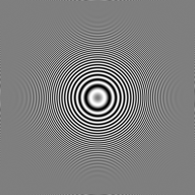

# Zone plate generation

- [Deployed as a next.js (w/Rust/WASM)](https://zone.v.imetrical.com/)

- next.js - WASM - Rust: `./nextjs-wasm-rust/`
- static image/video generation in Go: `./static-go/`
- Original `C++` code from CRC in `./legacy-CRC/`

| VT Zone Plate | VH Zone Plate |
|:-:|:-:|
| ||

## TODO

- Styling
- History (with scans and pictures)